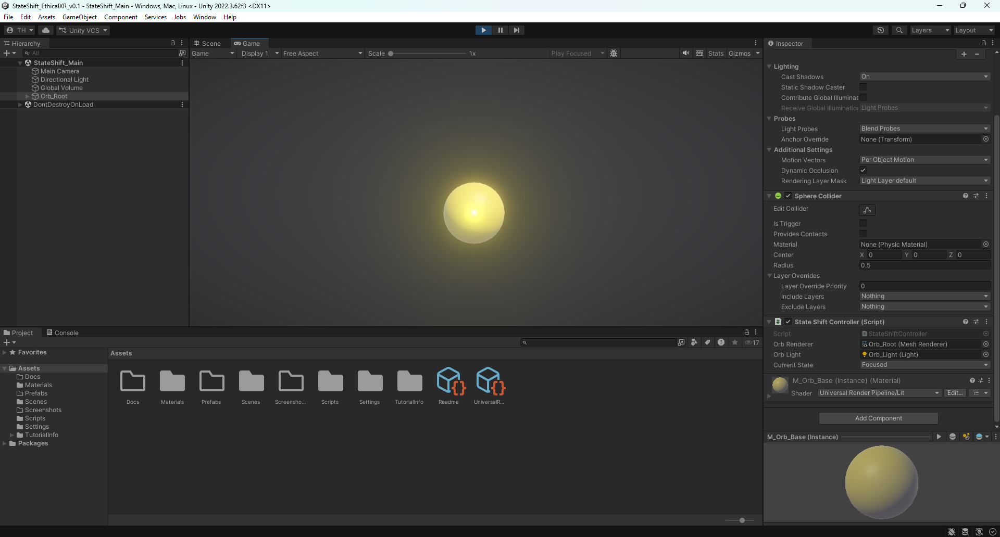

# AuroraNode_StateShift_EthicalXR_v01

> What if XR adapted to you — instead of demanding your attention?
Built as part of an exploration into ethical, state-driven interaction design —  
where technology supports human awareness instead of competing for it.

Prototype exploring emotion-driven XR systems through real-time visual feedback.

## Overview
AuroraNode StateShift Ethical XR is a Unity-based prototype exploring how interactive systems can respond to human state in a more ethical, readable, and human-centered way.

Instead of demanding constant attention, this project investigates how XR systems can adapt their visual behavior based on different modes of user state.

The current prototype focuses on a responsive orb system built around three state conditions:
- **Idle**
- **Calm**
- **Fire**

These states influence the orb’s visual output through changes in color, light, and motion behavior.

## Core Concept
The system follows a simple but scalable structure:

**Input → State → Parameters → Visual Feedback**

This makes it possible to explore how emotional tone, energy, and interaction intensity can be translated into clear visual responses inside an XR-oriented environment.

## Purpose
This prototype is designed to explore:

- Ethical state-based interaction design
- Human-centered XR behavior
- Emotional feedback loops in visual systems
- Controlled and interpretable system responses

The broader intention is to design experiences that support:
- presence
- calmness
- awareness
- meaningful interaction

## Current State Logic
The prototype currently includes three main states:

- **Idle** → neutral baseline
- **Calm** → softer, grounded visual behavior
- **Fire** → more intense, activated response

Each state affects:
- orb material appearance
- light intensity
- pulse / response feeling

## Technical Setup
- **Engine:** Unity
- **Language:** C#
- **Render Pipeline:** URP
- **Main Script:** `StateShiftController.cs`

## Repository Structure
- `Assets/Scripts/` → core logic
- `Assets/Materials/` → orb material setup
- `Assets/Screenshots/` → project visuals
- `Assets/Docs/` → supporting notes and early prototype context
- `Packages/` and `ProjectSettings/` → Unity project configuration

## Evolution
This version represents an updated and more refined iteration of the original StateShift Ethical XR concept.

Earlier exploration material is included to show development over time and provide context for the prototype’s direction.

## Why This Matters
Many digital systems are built to capture and hold attention.

This project explores an alternative direction:

**What if XR systems could respond to human state instead of competing for it?**

That question sits at the center of this prototype.

## Next Steps
Planned future expansions include:

- audio-reactive behavior
- prompt-driven state changes
- voice integration
- XR adaptation for Meta Quest
- biofeedback-driven interaction layers

## Author
XR & AI Creative Developer focused on building systems where technology responds to human state, not the other way around.

---

## Open to Collaboration

Currently exploring state-driven XR systems and human-centered interaction design.

Interested in connecting with:
- XR developers
- Creative technologists
- Studios exploring new interaction paradigms

→ Open for LIA, collaborations, and experimental projects
